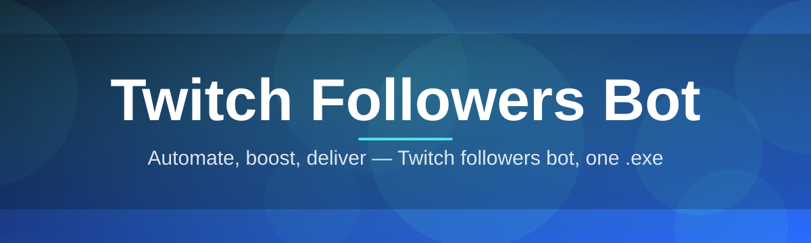
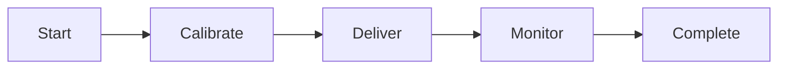

# twitch-followers-booster 🚀🎮

  

*Grow your channel while you sleep — a Twitch followers bot built for creators who'd rather stream than beg for attention.*

---

## 📡 Overview

Twitch is loud. Thousands of channels go live every minute, and the algorithm rewards momentum — followers, viewers, chat activity — not talent alone. **twitch-followers-booster** exists to give new and mid-size streamers the momentum that platform discovery normally hoards for top-tier channels. It's a lightweight Windows tool purpose-built to simulate organic follower growth patterns, so your channel doesn't look like it's shouting into a void every time you go live.

This isn't a magic wand. It's infrastructure. Streamers, clip farmers, and small esports orgs use it as a growth accelerant layered on top of real content, real streaming hours, and real community-building. The tool handles the tedious, repetitive part of channel growth — follower acquisition — so you can spend your energy on the stream itself, your overlays, your community Discord, your actual craft.

Built for 2026's Twitch landscape — tighter anti-spam heuristics, smarter discovery algorithms, pickier viewers — the bot is engineered to work *with* the platform's rhythms, not against common sense. No browser extensions, no shady tokens pasted into sketchy forms. Just a standalone Windows executable that does one job and does it cleanly.

  

---

## ⚡ What It Actually Does

  

| Capability | What It Means For You |
|---|---|
| **Adaptive Growth Curve** | Follower delivery is paced, not dumped — mimics natural discovery spikes instead of a suspicious flat-line jump. |
| **Zero-Footprint Install** | One `.exe`, no background services, no registry sprawl. Delete the folder, it's gone. |
| **Channel Health Dashboard** | Live counters for followers gained, session uptime, and delivery rate — all in one glanceable window. |
| **Smart Throttling Engine** | Automatically slows down during platform-flagged high-traffic windows to stay under the radar of aggressive rate-limiters. |
| **Session Scheduler** | Queue growth sessions around your actual stream schedule instead of babysitting the app. |
| **Dark & Light Theming** | Because control panels shouldn't burn your retinas at 3AM before a stream. |
| **One-Click Pause/Resume** | Stop instantly if you're multitasking — no corrupted state, no relaunch needed. |
| **Lightweight Footprint** | Sub-40MB install, minimal RAM usage — runs fine alongside OBS and Discord. |

> [!TIP]
> Pair follower growth sessions with active streaming hours — the algorithm loves channels that show *live* engagement alongside rising follower counts.

---

## 🧭 Getting Started

1. **Visit the landing page** — tap the download button above or below.

2. **Grab the installer** — a single standalone `.exe`, no bundled extras.

3. **Launch it** — Windows may show a SmartScreen prompt for new tools; click "More info" → "Run anyway."

4. **Set your channel handle, pick a growth pace, hit Start.** That's the whole workflow.

> [!NOTE]
> First launch takes a few seconds longer while the app initializes local config files. Subsequent launches are instant.

---

## 🖥️ System Requirements

| Requirement | Details |
|---|---|
| OS | Windows 10 (64-bit) or Windows 11 |
| Dependencies | None — fully standalone |
| Disk Space | ~40 MB |
| RAM | 150 MB typical usage |
| Network | Stable internet connection |
| Permissions | Standard user (admin not required) |

> [!IMPORTANT]
> This tool is Windows-only. There is no macOS or Linux build, and there are no plans for one in the near term — the architecture is tightly coupled to native Windows APIs for performance reasons.

---

## ⚙️ How It Works

The engine runs a simple, predictable loop under the hood:

1. **Input** — you provide your channel handle and desired pace.
2. **Calibration** — the app models a natural-looking growth curve based on your current follower count.
3. **Delivery** — followers are added in throttled batches, spaced to avoid looking automated.
4. **Monitoring** — the dashboard tracks progress in real time.
5. **Completion** — session ends, summary report displayed.

---

## 🩺 Troubleshooting

<strong>The app says "SmartScreen blocked this app" — is it safe?</strong>

Yes. This happens with any new, unsigned executable on Windows. Click "More info" then "Run anyway." Signing certificates are on the roadmap.

<strong>My follower count isn't updating instantly.</strong>

Twitch's own follower display can lag behind real-time changes by a few minutes. The in-app dashboard reflects delivery, not Twitch's cache refresh speed.

<strong>Can I run this while I'm live streaming?</strong>

Yes — it's designed to run alongside OBS, Streamlabs, and Discord with minimal resource overhead.

<strong>The growth pace slowed down on its own. Why?</strong>

That's the Smart Throttling Engine reacting to platform traffic conditions. It's intentional — patience here protects your channel long-term.

<strong>Does this require my Twitch password or OAuth token?</strong>

No. You only enter your public channel handle. Nothing sensitive is ever requested.

<strong>Antivirus flagged the download — what now?</strong>

False positives happen with growth-automation tools due to generic heuristic flags. Check the SHA hash on the landing page against your download if you want extra assurance.

---

## 🎨 UI / UX Details

> [!TIP]
> Everything in the interface is reachable by keyboard — built for streamers who hate touching the mouse mid-broadcast.

| Shortcut | Action |
|---|---|
| `Ctrl + S` | Start session |
| `Ctrl + P` | Pause/Resume |
| `Ctrl + D` | Toggle dark/light theme |
| `Ctrl + Q` | Quick-exit |
| `F5` | Refresh dashboard stats |

**Themes:** Dark (default), Light, and an OLED-black "Stream Mode" designed to sit unobtrusively on a second monitor.

**Settings panel:** growth pace slider, session auto-stop timer, notification toggles, and a minimal/verbose logging switch.

---

## 🤝 Contributing & Community

This project grows because people use it, break it, and report back.

- Open an issue for bugs, oddities, or feature requests.
- Fork it, tinker, submit a pull request — clean diffs get reviewed fast.
- Join the discussion tab for growth-strategy talk and roadmap input.

> [!WARNING]
> Please don't open issues asking for follower delivery guarantees tied to specific timeframes. Growth pacing is intentionally variable — that's the point.

---

## 📜 License

Released under the [MIT License](LICENSE), 2026. Use it, fork it, ship it — just keep the license notice intact.

---

## ⚠️ Disclaimer

This tool is provided for educational and channel-growth experimentation purposes. Twitch's Terms of Service evolve — users are responsible for understanding and complying with current platform rules. The maintainers assume no liability for account actions taken by Twitch as a result of tool usage.

  

